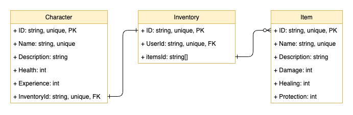
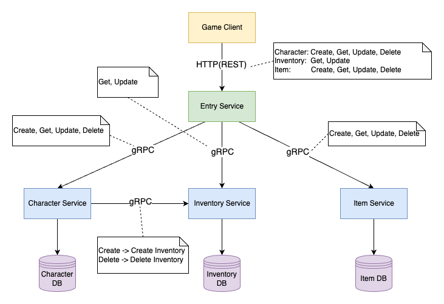

# Multiplayer Game


## Introduction

### Requirements 
This is a take-home assessment project. The task is to build a microservice application that stores characters and their item inventories for a multiplayer game.  
It is required to use [Goa](https://goa.design/), a design-first microservice framework with [Golang](https://go.dev/) to finish the entire task.
There are 4 microservices in total:
> An HTTP/JSON front entry service which provides an API to manipulate the characters, their inventories, and the items that exist

> A GRPC back service that handles CRUD operations for the characters and their attributes

> A GRPC back service that handles CRUD operations for the characters’ inventories

> A GRPC back service that handles CRUD operations for the items that exist and their attributes

> The front entry service should not have any state of its own and should call the appropriate back services via GRPC to implement its operations. The back services may store their state in memory.

### Database Schemas

The entry service doesn't have a DB schema, and the rest 3 services, which are Character, Inventory, and Item, have their own schema.



### Architecture

The overall architecture is as the image below shows.



## Configuration

### Golang

Please follow [Go install instruction](https://go.dev/doc/tutorial/getting-started#install) to install Go

When Go installation is finished, type the following command to check if the command `go` is in your environment PATH

```
go version
```

If installed correctly, you will see the version of Go in your machine like the follow
```
go version go1.20.3 darwin/arm64
```

### GOROOT & GOPATH
Use the command `go env` to see you current GOROOT and GOPATH. Put this entire project user `$GOPATH/src/`


### Goa
Please follow [Goa instruction](https://goa.design/learn/getting-started/) to install Goa


### Go mod
Open a terminal and `cd` to the `mpg` directory, run the command `go mod tidy`. That's it, every thing should be ready to launch this project.


### Database
This project uses MongoDB as the database. If you want to run the services on you local machine, make sure you have installed MongoDB and start a Mongo server.  
In every microservice, take the `Character` service for example, modify the origin of the existing one with your local origin in `characters/internal/config/config.go`, replace the `mongodb://localhost:27017` with your own origin.

## Commands

### Run the services
Run the `start.sh` file in the root directory

### Use CLI tools
There are some cli tools already built for each microservice. They are under `mpg/bin`. You can tell from the directory names, the cli files are binary executive files like `*_cli`.  
Take entry service for example, run the following command to see the usage
```
./entry_cli --help
```
In the prompts, there are further information to guide you through.


### Use tools like Postman
To send HTTP requests using REST URLs to the entry service, I recommend to using Postman. (However, you can stick to using commands in a console)

For API path instructions, there's no GUI swagger server providing interactive API documentation. You can refer to `mpg/entry/gen/http/openapi`.  
I'll build up the documentation server as soon as possible.

Here's some prompts that may give you some guide.  
```
"CreateCharacter" mounted on POST /character  
"GetCharacter" mounted on GET /character/{id}  
"UpdateCharacter" mounted on PATCH /character/{id}  
"DeleteCharacter" mounted on DELETE /character/{id}  
"GetInventory" mounted on GET /inventory/{id}  
"UpdateInventory" mounted on PATCH /inventory/{id}  
"CreateItem" mounted on POST /item  
"GetItems" mounted on GET /item  
"UpdateItem" mounted on PATCH /item/{id}  
"DeleteItem" mounted on DELETE /item/{id}  
HTTP server listening on "localhost:8050"
```

## Author
- Bruce Cai

- caifanglei1998@gmail.com

Feel free to contact me if you have any question.

